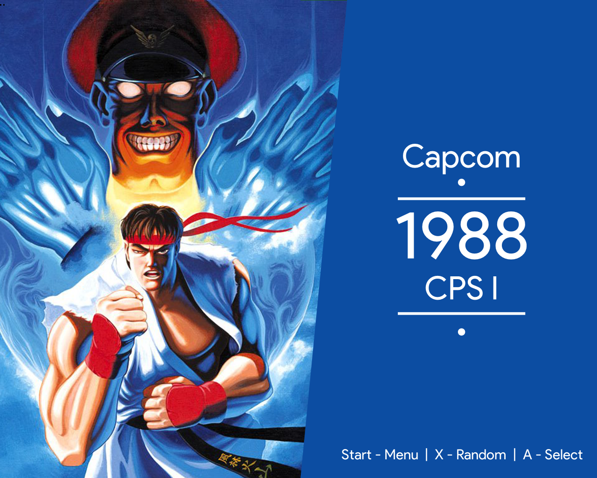
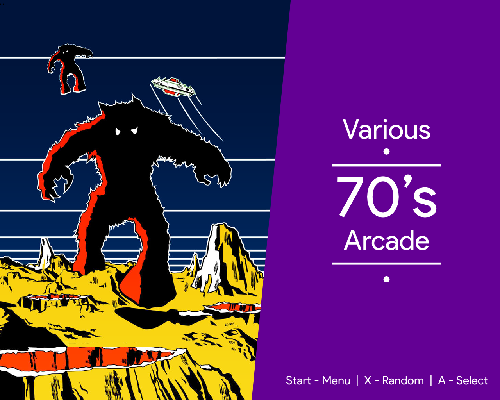
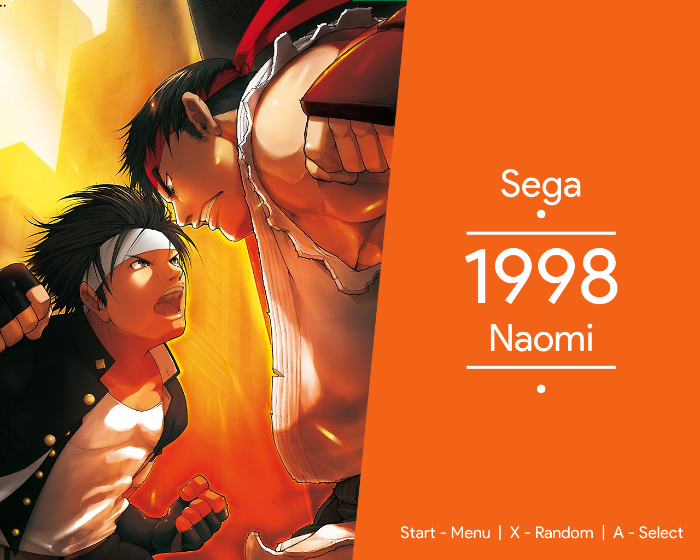
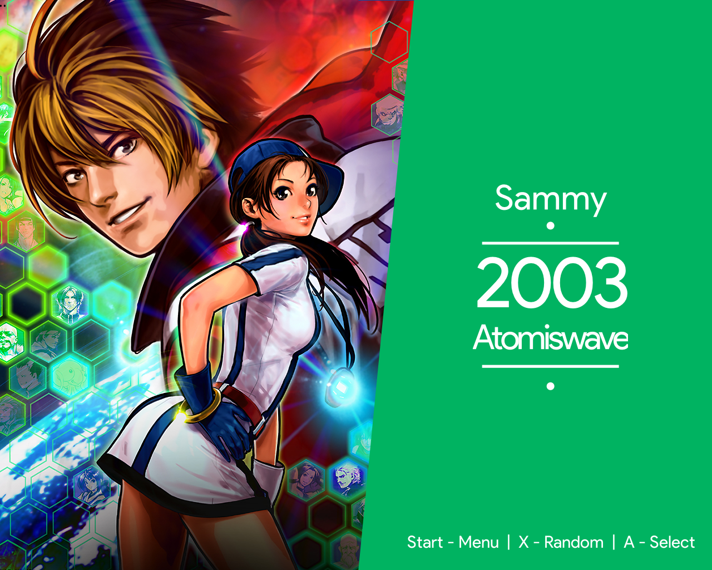
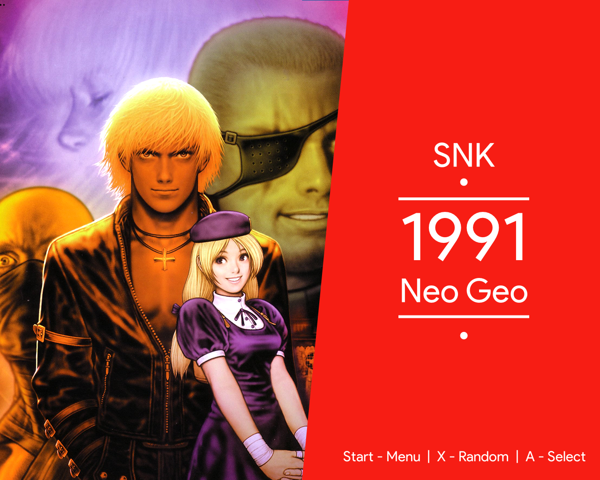
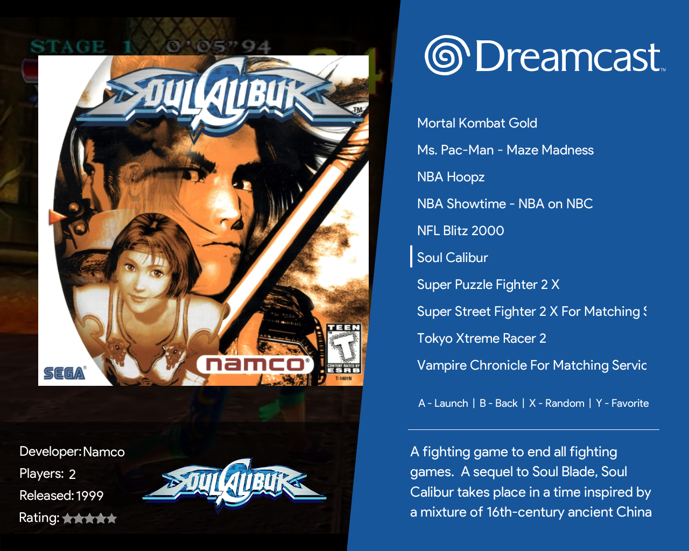
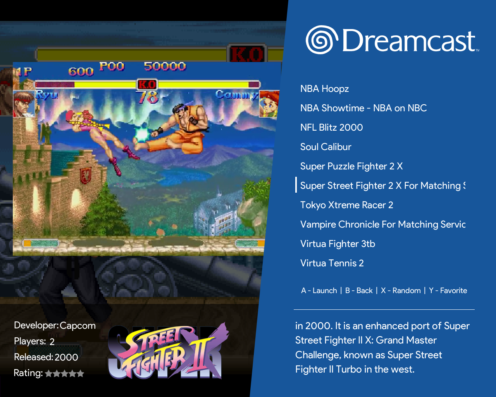
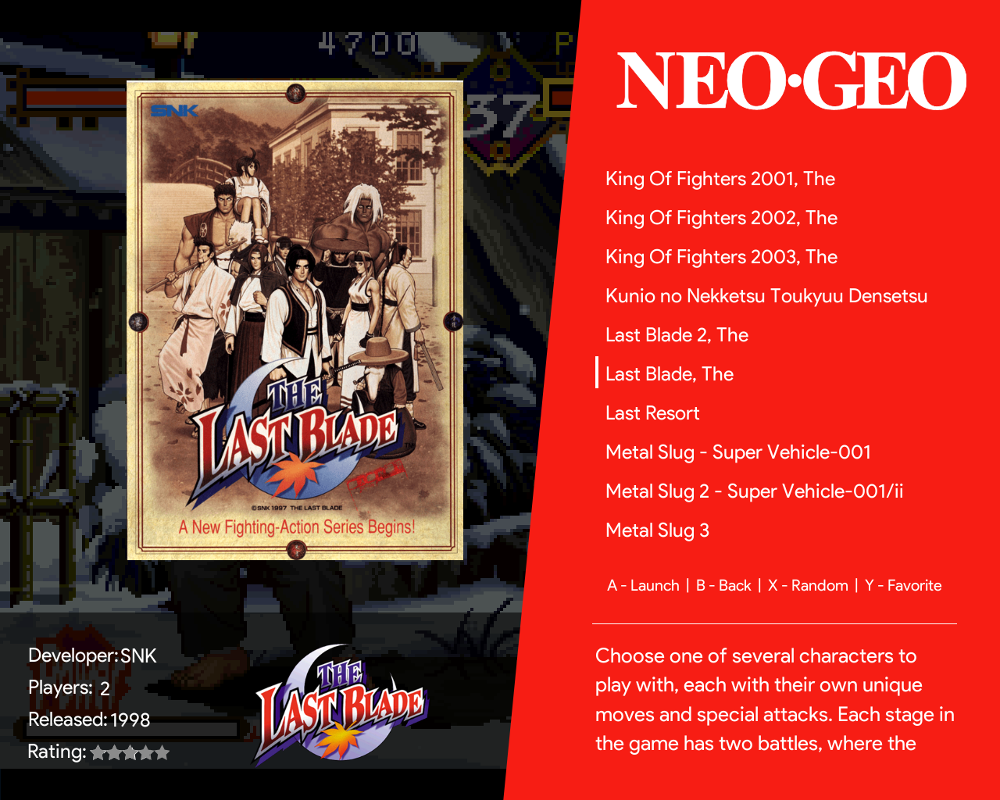
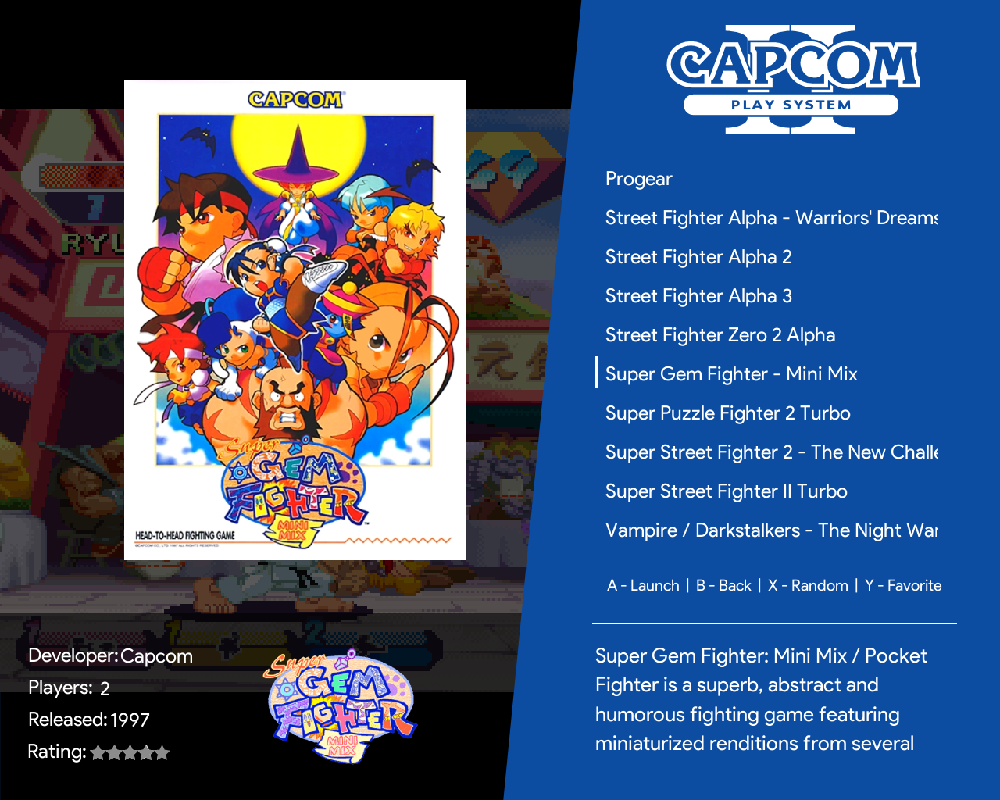

# Angular Artwork Theme for 5:4 Resolutions

## Intro
This is a free non-commercial modification of lilbud's https://github.com/lilbud/es-theme-angular made by myself (Elratauru).

It adds many features as:
- Unique Artworks for each System based on popular games for each one. Many of those have been cleaned, removed logos or text, resized and adjust to fit the screen a little better.
- Includes a template for making your own system artwork in the assets\backgrounds folder!
- New logos for SFC, Famicom, CPS1 to 3, and some others that were missing before.
- Adjusted the cover, screenshots and videos to fit a little better without missing anything of importance.
- Adjustments all over the place for 5:4 screens! Better spacing on many places.

As lilbud did before, I made this for my own personal cabinet... and this is because so many people requested me to share it. 
It's designed to fit an Arcade1up 5:4 screen (1st and 2nd generation screens), so if you need it for a 4:3 screen, you will have to adjust a few things... I don't plan to do it myself, so have fun!

## Screenshots

### System Select 

 |  
:-------------------------:|:-------------------------:
 |  

### Game Selection 

 Game Cover (or Flyer) |  Video Playback
:-------------------------:|:-------------------------:
 **Game Flyer** |  **Game Flyer**

## Licence

Same as the original theme, this theme has a creative commons CC-BY-NC-SA licence.

## Special Thanks

- Lilbud for the original theme - I love it's simplicity
- r/Retropie - For supporting and encouraging the arcade build!

